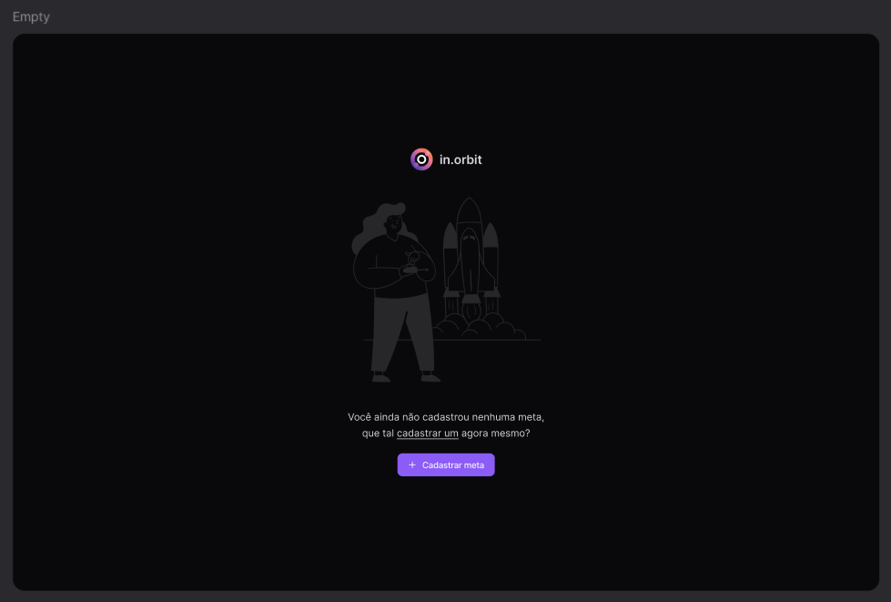
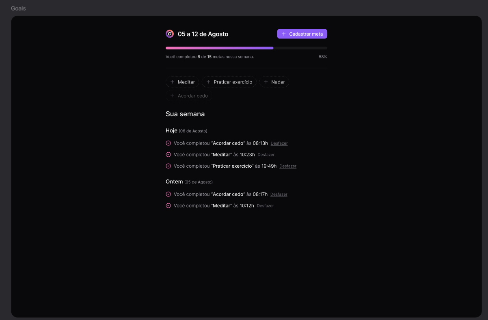

<div align="center">

<br/>
<br/>
</div>
<div align="center">

[**Sobre**](#-sobre) &nbsp;&nbsp;**|**&nbsp;&nbsp;
[**Objetivo**](#-objetivo) &nbsp;&nbsp;**|**&nbsp;&nbsp;
[**Tecnologias e ferramentas**](#-tecnologias-e-ferramentas) &nbsp;&nbsp;**|**&nbsp;&nbsp;
[**Features**](#-features) &nbsp;&nbsp;**|**&nbsp;&nbsp;
[**Demonstração**](#-demonstração) &nbsp;&nbsp;**|**&nbsp;&nbsp;
[**Protótipo**](#-protótipo) &nbsp;&nbsp;**|**&nbsp;&nbsp;
[**Referência da API**](#-referência-da-api) &nbsp;&nbsp;**|**&nbsp;&nbsp;
[**Instalação e execução**](#-instalação-e-execução) &nbsp;&nbsp;**|**&nbsp;&nbsp;
[**Como contribuir**](#-como-contribuir) &nbsp;&nbsp;**|**&nbsp;&nbsp;
[**Autor**](#-autor)

</div>

## 📃 Sobre



**In.orbit** é o projeto desenvolvido durante a trilha de React da **NLW Pocket JS**, um evento online produzido pela [**Rocketseat**](https://github.com/Rocketseat).

Trata-se de uma aplicação web que permite aos usuários fazer um gerenciamneto de suas metas.

## 🎯 Objetivo

O objetivo principal do **In.orbit** é um site desktop de registro de metas com progresso semanal. 

## 🚀 Tecnologias e ferramentas

<table>
  <tr>
    <td align="center" width="100">
      <a href="https://reactjs.org/" target="_blank" rel="noopener noreferrer">
        
      </a>
      <span>React</span>
    </td>
    <td align="center" width="100">
      <a href="https://www.typescriptlang.org/">
        
      </a>
      <span>TypeScript</span>
    </td>
    <td align="center" width="120">
      <a href="https://tailwindcss.com" target="_blank" rel="noopener noreferrer">
        
      </a>
      <span>Tailwind CSS</span>
    </td>
    <td align="center" width="100">
      <a href="https://vitejs.dev/" target="_blank" rel="noopener noreferrer">
        
      </a>
      <span>Vite.js</span>
    </td>
  </tr>
</table>

## ✨ Features

✅ Criação de metas</br>
✅ Barra de progresso para ter um acompanhamento visual das metas cumpridas</br>
✅ Resumo de metas</br>
✅ Design responsivo</br>


## 💻 Demonstração

<figure style="width: 100%">
  <figcaption style="margin-bottom: 8px">Criação de uma meta:</figcaption>
  
</figure>

<figure style="width: 100%">
  <figcaption style="margin-bottom: 8px">Metas:</figcaption>
  
</figure>

<figure style="width: 100%">
  <figcaption style="margin-bottom: 8px">Resumo das metas semanais:</figcaption>
  
</figure>

## 🎨 Protótipo

O protótipo do projeto foi desenvolvido utilizando a ferramenta [**Figma**](https://www.figma.com/). Você pode acessá-lo [aqui](https://www.figma.com/design/ikW5zOTGj8XO4yHQKHdhTd/NLW-Pocket-JS-%E2%80%A2-in.orbit-(Community)?node-id=82-2&node-type=canvas&t=ttxkmTUG5j5gqkz8-0).

## ⚙ Referência da API

A API utilizada neste projeto foi desenvolvida pela trilha de Nodejs do NLW Journey. Você pode acessar o repositório do backend [aqui](https://github.com/mathrb22/nlw-journey-nodejs).

🔗 Documentação da API base: [NLW Journey Nodejs API](https://nlw-journey.apidocumentation.com/reference)

> **Nota:** Para rodar o frontend em sua máquina, será necessário ter o backend rodando localmente para conexão dos recursos do banco de dados. Siga as instruções no repositório do backend para configurá-lo em sua máquina.

## 🔧 Instalação e execução

Para baixar o código-fonte do projeto em sua máquina, primeiramente terá que ter instalado o [**Git**](https://git-scm.com/).
Com o Git instalado, em seu terminal execute o seguinte comando:

```bash
git clone https://github.com/mathrb22/nlw-journey-frontend.git
```

Para instalar as dependências e executar o projeto terá que ter instalado em sua máquina o [**node.js**](https://nodejs.org/en/), que vem acompanhado do npm. Instale as dependências usando o comando abaixo:

```bash
npm install
```

Executar o projeto:

```bash
npm run dev
```

A aplicação estará disponível em http://localhost:5173. Você poderá acessá-la a partir do seu navegador.

## 💡 Como contribuir

- Faça um **_fork_** desse repositório;
- Crie um **branch** para a sua feature: `git checkout -b minha-feature`;
- Faça um **commit** com suas alterações: `git commit -m 'feat: Minha nova feature'`;
- Faça um **push** para o seu branch: `git push origin minha-feature`;
- Faça um **pull request** com sua feature;

Pull requests são sempre bem-vindos. Em caso de dúvidas ou sugestões, crie uma _**issue**_ ou entre em contato comigo.

## 🧑‍💻 Autor

Desenvolvido com 💚 por <a href="https://github.com/jefferson-gbarbosa">Jefferson Gonçalves</a>

<div style="display: flex;">
  <a href="https://www.linkedin.com/in/jefferson-gbarbosa/" target="_blank"></a>
  <a href="mailto:jeffersonqx@gmail.com"></a>
</div>
